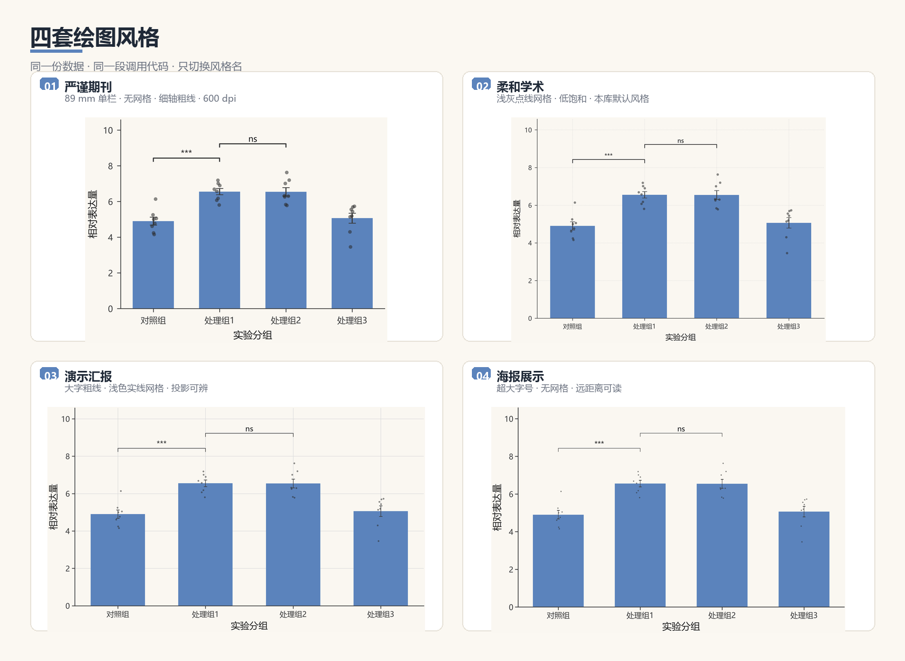
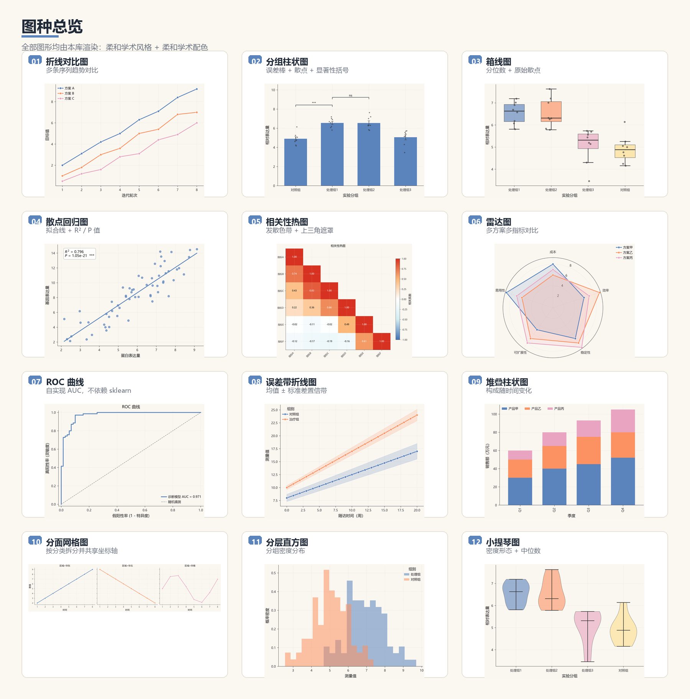
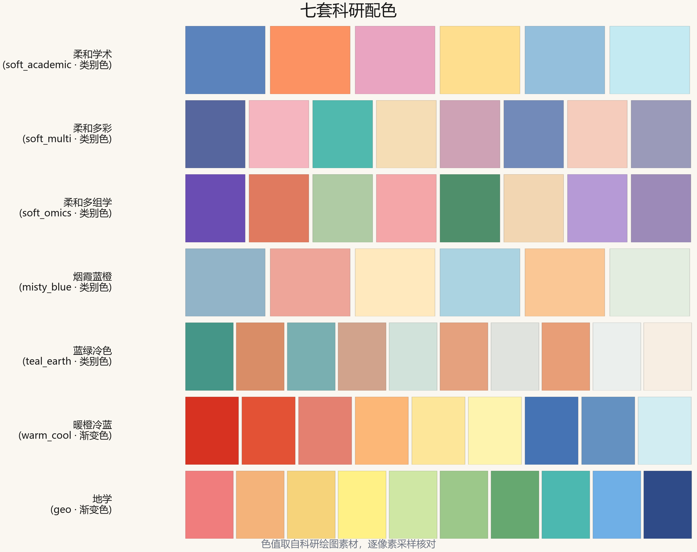

# modelfig

> 面向科研与数学建模的 matplotlib 绘图模板库 —— 风格、配色、底色三者正交，一份数据多套观感。

[](LICENSE)
[](https://www.python.org/)
[](https://github.com/1fish4/modelfig/actions)
[](https://gitee.com/not-even-xianyu-can-handle-it/modelfit)

## 四套风格，一眼选定

同一份数据、同一段调用代码，只改风格名：



| 风格 | 定位 | 视觉特征 | 适用场景 |
|------|------|----------|----------|
| `journal` | 严谨期刊 | 89 mm 单栏 · 无网格 · 0.6pt 细轴 · 600 dpi | 论文投稿、学位论文 |
| `soft` | 柔和学术 | 浅灰点线网格 · 低饱和 · 细轴配粗线 | 组会汇报、论文插图 |
| `slide` | 演示汇报 | 大字粗线 · 浅色实线网格 | 答辩 PPT、课堂展示 |
| `poster` | 海报展示 | 超大字号 · 无网格 · 极简装饰 | 学术海报、远距离展示 |

## 图种总览



## 七套科研配色



色值取自科研绘图素材，逐像素采样并核对过印刷标注。每套配色按
「任意两色都能分开」重新排序——浅色系一律后置，因为浅色作线条几乎看不见。

## 这个库解决什么问题

写论文、做答辩 PPT 时，同一份数据往往要出两种图：投稿用要**细线小字、黑白可辨**，
答辩用要**粗线大字、投影清晰**。通常做法是复制一份绘图代码、改二十来处样式参数——
改到第三版就不知道哪份是哪份了。

`modelfig` 把"数据"和"外观"彻底分开：

```python
import modelfig as mf

mf.set_style("soft", palette="soft_academic")   # 柔和风 + 蓝橙配色
mf.line([1, 2, 3], [2, 4, 9], xlabel="时间", ylabel="数值")
mf.save("figure.png")

mf.set_style("slide", palette="soft_multi")     # 换成答辩风，数据一行没改
mf.line([1, 2, 3], [2, 4, 9], xlabel="时间", ylabel="数值")
mf.save("figure_slide.png")
```

## 特性

- **4 套风格 × 7 套配色 = 28 种观感**，自由组合，另有 `cream` 米色底可选
- **中文字体零配置**：自动探测 Windows / macOS / Linux 中文字体，告别"豆腐块"
- **两层接口**：数组接口简单直白，DataFrame 接口支持分组与统计标注
- **17 种图形**，覆盖科研论文与数学建模的高频图型
- **统计功能内置**：自动标准误、显著性括号、线性回归 R²/P 值、ROC 曲线与 AUC
  （梯形积分自实现，**不依赖 scikit-learn**）
- **风格与配色均可注册扩展**，不改源码即可定制

## 安装

```bash
pip install modelfig
```

从源码安装（开发用）：

```bash
git clone https://github.com/1fish4/modelfig.git
cd modelfig
pip install -e ".[dev]"
```

## 快速开始

### 数组接口（简单直白）

```python
import numpy as np
import modelfig as mf

mf.set_style("soft", palette="soft_academic")

x = np.arange(1, 9)
y = np.vstack([
    [2.0, 3.1, 4.2, 5.0, 6.3, 7.1, 8.4, 9.2],
    [1.0, 1.8, 3.0, 3.6, 5.0, 5.4, 6.8, 7.0],
])

mf.line(x, y, labels=["方案 A", "方案 B"],
        xlabel="迭代轮次", ylabel="目标值", title="算法收敛曲线对比")
mf.save("convergence.png")
```

### DataFrame 接口（分组与统计）

```python
import modelfig as mf

df = mf.load_csv("experiment.csv")   # 带中文编码回退

mf.set_style("soft", palette="soft_academic")

# 分组柱状图：自动标标准误、叠加散点、画显著性括号
mf.barplot(
    df, x="处理", y="产量",
    show_points=True,
    annotate=[("对照组", "处理组1"), ("处理组1", "处理组2")],
    xlabel="实验分组", ylabel="产量（kg）",
)

# 散点 + 回归线 + R²/P 值标注
mf.regplot(df, x="温度", y="产率", xlabel="温度（℃）", ylabel="产率（%）")

# 箱线图，叠加原始散点
mf.boxplot(df, x="处理", y="产量", show_points=True)
```

## 支持的图形

### 通用层（数组接口）

| 函数 | 说明 |
|------|------|
| `line(x, y)` | 折线图，支持多序列对比 |
| `bar(cats, values)` | 柱状图，支持分组 |
| `stacked_bar(cats, values)` | 堆叠柱状图 |
| `scatter(x, y, sizes=)` | 散点图 / 气泡图 |
| `box(groups)` | 箱线图，可叠加散点 |
| `violin(groups)` | 小提琴图 |
| `errorbar(x, y, err, band=)` | 折线 + 误差棒 / 误差带 |
| `dual_axis(x, y1, y2)` | 双 Y 轴图 |
| `heatmap(matrix)` | 热力图，可标注数值 |
| `radar(cats, values)` | 雷达图，支持多方案 |

### 统计层（DataFrame 接口）

| 函数 | 说明 |
|------|------|
| `lineplot(data, x, y, hue=)` | 折线图，按分类自动分组 |
| `scatterplot(data, x, y, hue=, size=)` | 散点图 / 气泡图，按类别着色 |
| `regplot(data, x, y)` | 散点 + 线性回归 + R²/P 值 |
| `barplot(data, x, y, hue=)` | 分组柱状图，自动误差棒 + 显著性括号 + 散点 |
| `boxplot(data, x, y)` | 箱线图 |
| `violinplot(data, x, y)` | 小提琴图 |
| `histplot(data, x, hue=)` | 直方图，可分层 |
| `errorbar_line(data, x, y, err=, band=)` | 折线 + 误差棒 / 置信带 |
| `roc_curve(y_true, y_score)` | ROC 曲线 + AUC |
| `corr_heatmap(data, mask_upper=)` | 相关性热图，发散色带，可遮上三角 |
| `pairplot_grid(data, hue=)` | 配对关系矩阵 |
| `stackplot(data, x, y, kind=)` | 堆叠柱状图 / 堆积面积图 |
| `facet_grid(data, x, y, col=)` | 分面网格 |

所有绘图函数都返回 `(fig, ax)`，可继续用原生 matplotlib 接口微调；
也可用 `ax=` 参数传入自己的子图，便于多图排版。

## 风格与配色

三个维度自由组合：

```python
mf.set_style("soft", palette="soft_academic", background="cream")
#             ↑风格        ↑配色              ↑底色（white / cream）
```

**风格**（`mf.style_info()` 查看全部）

| 名称 | 定位 | 适用 |
|------|------|------|
| `journal` | 严谨期刊 | 论文投稿、学位论文 |
| `soft` | 柔和学术 | 组会汇报、论文插图（默认） |
| `slide` | 演示汇报 | 答辩 PPT |
| `poster` | 海报展示 | 学术海报 |

**配色**（`mf.list_palettes()` 查看全部，`mf.describe_palette(name)` 查看色值）

| 名称 | 中文 | 类型 | 色数 | 适用 |
|------|------|------|------|------|
| `soft_academic` | 柔和学术 | 类别色 | 6 | 最百搭 |
| `soft_multi` | 柔和多彩 | 类别色 | 8 | 5~8 组的分组对比 |
| `soft_omics` | 柔和多组学 | 类别色 | 8 | 聚类散点、UMAP |
| `misty_blue` | 烟霞蓝橙 | 类别色 | 6 | 低对比柔和风 |
| `teal_earth` | 蓝绿冷色 | 类别色 | 10 | 地图、时序、多变量 |
| `warm_cool` | 暖橙冷蓝 | 渐变色 | 9 | 热力图、色阶映射 |
| `geo` | 地学 | 渐变色 | 10 | 分区填色、分箱色阶 |

## 自定义

```python
# 自定义配色
mf.register_palette("myschool", {"校蓝": "#005BAC", "校红": "#E60012"})
# 自定义风格
mf.register_style("myreport", {"font.size": 12, "lines.linewidth": 1.8})

mf.set_style("myreport", palette="myschool")
```

## 查看示例

```bash
python examples/demo.py      # 输出 36 张图到 examples/output/
python examples/gallery.py   # 重新生成 README 中的展示图
```

## 项目结构

```
modelfig/
├── modelfig/
│   ├── __init__.py      # 对外 API
│   ├── styles.py        # 风格系统
│   ├── palettes.py      # 配色库
│   ├── fonts.py         # 中文字体自动配置
│   ├── plots.py         # 通用层绘图（数组接口）
│   └── stats.py         # 统计层绘图（DataFrame 接口）
├── examples/
│   ├── demo.py          # 全部图种示例
│   └── gallery.py       # 生成 README 展示图
├── tests/test_smoke.py  # 冒烟测试（CI 使用）
├── docs/
│   ├── style-preview.md # 风格与配色设计说明
│   └── images/          # README 展示图
├── pyproject.toml
├── CHANGELOG.md
├── LICENSE
└── README.md
```

## 依赖

核心依赖：`matplotlib`、`numpy`、`pandas`、`scipy`

> 项目定位是"效果优先"，因此选用了 pandas 与 scipy 以获得更强的数据处理与统计能力。
> ROC 曲线与 AUC 为自实现，**不依赖 scikit-learn**。

## 开发

```bash
pip install -e ".[dev]"
pytest
```

新增绘图函数前请阅读 [CONTRIBUTING.md](CONTRIBUTING.md)。

## 路线图

- [x] v0.1.0 —— 两套风格 + 五种图形 + 中文字体自动配置
- [x] v0.2.0 —— 三套风格、四套配色、17 种图形、DataFrame 接口
- [x] v0.3.0 —— 四套风格（对齐期刊视觉规范）、七套精校配色、展示画廊、显著性括号
- [ ] v0.4.0 —— 聚类热图（带树状图）、平行坐标图、火山图
- [ ] v0.5.0 —— 导出内嵌字体的 PDF/SVG

## 许可证

本项目采用 [MIT License](LICENSE)。
